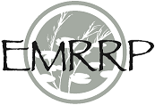

# FluvialGeomorph
The FluvialGeomorph ArcGIS toolbox. 

## Project Status

## Description
The FluvialGeomorph ArcGIS toolbox is the primary interface for the FluvialGeomorph project. 

## Funding
Funding for development and maintenance of FluvialGeomorph has been provided by the US Army Corps of Engineers (USACE) [Ecosystem Management and Restoration Research Program (EMRRP)](https://emrrp.el.erdc.dren.mil). 

## Authors
* [Michael Dougherty](mailto:Michael.P.Dougherty@usace.army.mil), Geographer, Rock Island District, U.S. Army Corps of Engineers
* [Christopher Haring](mailto:Christopher.P.Haring@usace.army.mil), Fluvial Geomorphologist/Research Physical Scientist, Coastal Hydraulics Laboratory, U.S. Army Corps of Engineers
* [Charles Theiling](mailto:Charles.H.Theiling@usace.army.mil), Ecologist, Ecological Laboratory, U.S. Army Corps of Engineers

## Getting Started
* User Manual: [https://FluvialGeomorph.github.io/FG-User-Manual](https://FluvialGeomorph.github.io/FG-User-Manual/index.html)
* Tech Manual: [https://FluvialGeomorph.github.io/FG-Tech-Manual](https://FluvialGeomorph.github.io/FG-Tech-Manual/index.html)