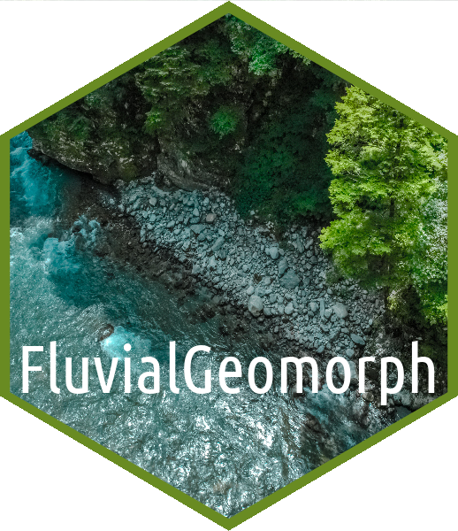
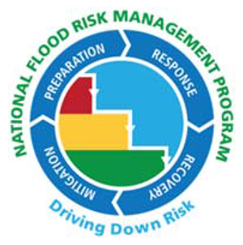
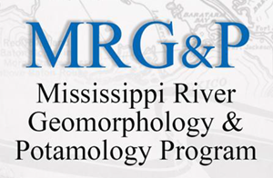

# FluvialGeomorph ArcGIS toolbox
The FluvialGeomorph ArcGIS toolbox provides a set of tools for extracting river channel dimensions from high resolution terrain data.  

## Project Status

## Description

The FluvialGeomorph ArcGIS toolbox is a Python/R toolbox used to rapidly assess stream condition and health using remotely sensed terrain data (LiDAR) at fine scale and for large spatial extents. This toolbox was initially inspired by the approach and techniques of the [River Bathymetry Toolkit, RBT](https://essa.com/explore-essa/tools/river-bathymetry-toolkit-rbt/#1512261459195-77c49866-a2eb) but expanded upon their effort adding additional analysis tools and reports. This project is open source to help ensure that these fluvial geomorphology tools remain available for the widest use, maintenance, and adaptation. 

## Funding
Funding for development and maintenance of FluvialGeomorph has been provided by the following US Army Corps of Engineers (USACE) programs:

* [Ecosystem Management and Restoration Research Program (EMRRP)](https://emrrp.el.erdc.dren.mil).
* [Regional Sediment Management Program (RSM)](https://rsm.usace.army.mil/)
* [Mississippi River Geomorphology and Potamology Program (MRG&P)](https://www.mvd.usace.army.mil/Missions/Mississippi-River-Science-Technology/MS-River-Geomorphology-Potamology/)
* [Flood Risk Management Program (FRM)](https://www.iwr.usace.army.mil/Missions/Flood-Risk-Management/Flood-Risk-Management-Program/)

## Latest Updates
Check out the [NEWS](NEWS.md) for details on the latest updates. 

## Authors
* [Michael Dougherty](mailto:Michael.P.Dougherty@usace.army.mil), Geographer, Rock Island District, U.S. Army Corps of Engineers 
<a itemprop="sameAs" content="https://orcid.org/0000-0002-1465-5927" href="https://orcid.org/0000-0002-1465-5927" target="orcid.widget" rel="me noopener noreferrer" style="vertical-align:top;">https://orcid.org/0000-0002-1465-5927</a>

* [Christopher Haring](mailto:Christopher.P.Haring@usace.army.mil), Fluvial Geomorphologist/Research Physical Scientist, Coastal Hydraulics Laboratory, U.S. Army Corps of Engineers
* [Charles Theiling](mailto:Charles.H.Theiling@usace.army.mil), Ecologist, Ecological Laboratory, U.S. Army Corps of Engineers

## Install
To install the FluvialGeomorph ArcGIS toolbox, click the [latest release](https://github.com/FluvialGeomorph/FluvialGeomorph-toolbox/releases/latest) above, and download the `.zip` archive. Unzip this archive into a working folder and open the FluvialGeomorph ArcGIS toolbox in ArcMap or ArcGIS Pro. `R` must be installed for many of the tools in this toolbox to work. Please see the [NEWS](NEWS.md) for the software compatibility matrix and release notes. See the [User Manual](https://FluvialGeomorph.github.io/FG-User-Manual/index.html) for more details on getting started. 

## Getting Started
Use the following guides to learn how to use the FluvialGeomorph ArcGIS toolbox. 

* User Manual: [https://FluvialGeomorph.github.io/FG-User-Manual](https://FluvialGeomorph.github.io/FG-User-Manual/index.html)
* Tech Manual: [https://FluvialGeomorph.github.io/FG-Tech-Manual](https://FluvialGeomorph.github.io/FG-Tech-Manual/index.html)

## Bug Reports
If you find any bugs while using the FluvialGeomorph ArcGIS toolbox, please open an [issue](https://github.com/FluvialGeomorph/FluvialGeomorph/issues) in this repository. 

### Credits
* [hex created using the `hexSticker` package](https://github.com/GuangchuangYu/hexSticker)
* [hex logo from vecteezy.com](https://www.vecteezy.com/free-vector/natural)
* [hex oblique aerial photo from pexels.com](https://www.pexels.com/@donaldtong94)